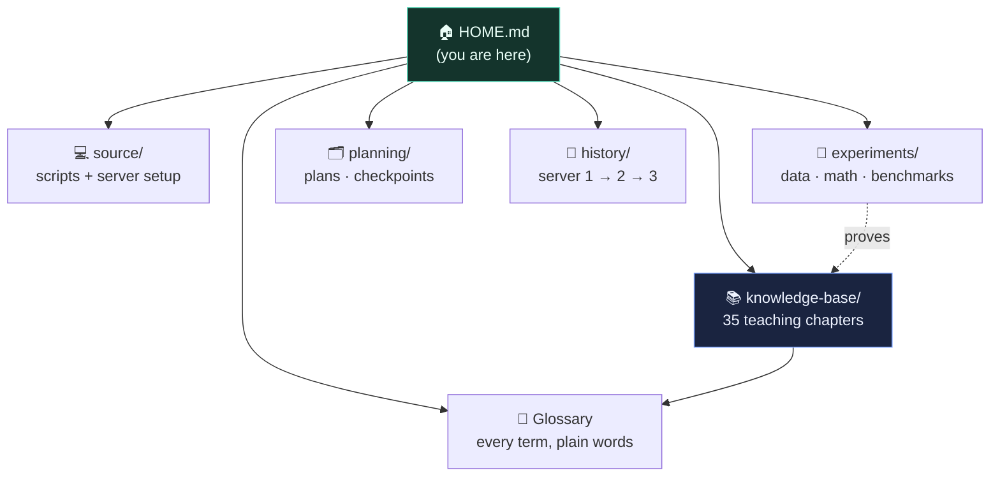

# 🏠 Self-Hosting GenAI — Vault Home

> **Master map of this project.** Open this folder as an Obsidian vault and start here.
> Everything is sorted into six areas: **Knowledge · Glossary · Analysis · Source · Experiments · Planning**, plus the **Journey** across our three servers.
> Prefer a browser? Open [`index.html`](index.html) for the clickable hub.

---

## 🗺️ The map

---

## 📚 Knowledge — the teaching (read this to *learn*)
The 35-chapter field guide. Every number measured on our own hardware, nothing rounded to look good.
- **[Open the guide →](knowledge-base/index.html)** (start at chapter 00)
- Highlights for *you*, the inference-learner:
  - [Ch.31 · What the GPU Is Actually Doing](knowledge-base/31-what-the-gpu-does.html) — it's just multiply-and-add
  - [Ch.32 · Thinking Like a Circuit](knowledge-base/32-thinking-like-a-circuit.html) — series/parallel, Thévenin ↔ compression
  - [Ch.33 · Long Video on a Small Card](knowledge-base/33-long-video-small-card.html) — chunk-and-chain
  - [Ch.34 · Open, Use, Close: FlashAttention](knowledge-base/34-open-use-close-flashattention.html) — the real memory wall
  - [Ch.35 · Is It Really Ours?](knowledge-base/35-is-it-really-ours.html) — systems vs the generative core

## 📖 Glossary — every term, plain words
- **[Master glossary →](knowledge-base/glossary.html)** — DiT, int8, FlashAttention, PagedAttention, step distillation… grouped & cross-linked.

## 💻 Source — code & how the box is built
- `source/scripts/` — helper scripts
- `source/new-server-setup/` — how the current **dalang box** (3× RTX 3060 Ti) was stood up

## 🧪 Experiments — data, math & benchmarks *(LaTeX + charts live here)*
The lab notebook. This is the "prove it, don't argue it" pile.
- [[answer]] — the founding **Memory-First Execution** experiment (run 33 B on 8 GB)
- [[EXPERIMENT-LOG]] — the running lab notebook
- [[BENCHMARK-int8-vs-q4]] — int8 vs Q4 head-to-head (Scene 3 stress test) → chart: `experiments/scene3_benchmark.png`
- [[SEED-EXPERIMENT]] — seeds: proof from data, not opinion
- [[MULTI-GPU-RESEARCH]] — will a 2nd GPU actually fix the eyes?
- [[SAMPLING-MATH]] — the sampling/flow-matching math (LaTeX)
- [[math-model]] — prompt → video, the full math model (also `experiments/math-model.html`)
- [[itung-itungan]] — quick cost/back-of-envelope numbers
- `experiments/8gb-experiment-answer.txt` — raw early answer dump

## 🗂️ Planning — plans, checkpoints, decisions
- [[PROJECT-SUMMARY]] — the one-page "what is this"
- [[CHECKPOINT-v0.1]] — the v0.1 milestone snapshot
- [[SETUP]] — how to run H3 (33 B video) on an 8 GB GPU
- [[hardware-investment-plan]] — GPU budget & investment plan (dalang.io)
- [[runpod-plan]] — ⚠️ archived (do not pursue)
- `planning/architecture.drawio` — architecture diagram (open in draw.io)

## 🧭 History — the journey across servers
- [[JOURNEY]] — **server 1 → server 2 → the dalang box** — the whole arc, so you can learn *how the thinking evolved*, not just where it landed.

---

## 🎬 The output (not in this vault)
Rendered clips live on the Mac at `~/Desktop/output/` — `exemplo-canta` (clean singer), `exemplo-hiphop` (2-person), and the earlier ComfyUI-era montages.

## 🧠 How to use this vault
- **Learning inference?** → Knowledge (start Ch.31) → Glossary for any jargon.
- **Want the evidence?** → Experiments.
- **Want the story?** → [[JOURNEY]].
- **Building the engine?** → Source + [Ch.32/34/35](knowledge-base/32-thinking-like-a-circuit.html).

*Math renders as LaTeX and diagrams as mermaid inside Obsidian and inside the knowledge-base pages.*
